# Gleeb.AI

[](https://nodejs.org/)
[](https://discord.js.org/)
[](https://ai.google.dev/)
[](LICENSE.md)

A Discord bot leveraging Google Gemini for advanced conversation, content understanding, image/video/audio recognition, and more. Powered by spoilage.

Forked from [Gemini-Discord-Bot](https://github.com/hihumanzone/Gemini-Discord-Bot) by [hihumanzone](https://github.com/hihumanzone).

Now with containerization!

---

## Features

- Chats in DMs or in servers (mention, always-respond mode, or personal active mode)
- Understands text, images, videos, audio, PDFs, and office/code files
- Supports per-user sessions plus optional channel-wide or server-wide shared memory
- Lets users toggle Gemini tools (Google Search, URL Context, Code Execution)
- Provides admin controls for moderation and server/channel behavior
- Includes **Nano Banana** mode for advanced image generation and editing capabilities
- Exports message content and full conversation history as shareable links
- **Containerized**, deploy to Docker and Podman containers seamlessly with automatic builds for new versions.

---

## Getting Started

### Prerequisites

- Podman and Quadlet via Systemd (recommended)
- Alternatively, Docker and Docker Compose
- Discord bot token ([create here](https://discord.com/developers/applications))
- Google Gemini API key ([get one here](https://aistudio.google.com/app/apikey))

### Setup

1. **Set up your container runtime:**
    - Download and move `gleebai.container` to ~/.config/containers/systemd/ (Podman & Quadlet)
    - Download `docker-compose.yml` (Docker Compose)
    - You could also manually run Docker and Podman commands. (not recommended)

2. **Configure environment variables:**
    - Fill in your Discord and Google API tokens in `gleebai.container` or `docker-compose.yml`.

3. **Start the bot:**
- Podman and Quadlet:
  ```
  systemctl --user daemon-reload
  systemctl --user start gleebai
  ```
- In same directory as `docker-compose.yml`, run `podman compose up -d` (Docker Compose)

*Note: You can also run this with not as a container via Node or by deploying to Vercel.*

## Discord Bot Setup Checklist

Enable these intents in the Discord Developer Portal:

- Guilds
- Guild Messages
- Message Content
- Direct Messages

Recommended bot permissions:

- Send Messages
- Embed Links
- Attach Files
- Use Slash Commands
- Manage Messages

## Commands

| Command | Who can use it | Purpose |
|---|---|---|
| `/settings` | Everyone | Open personal control center |
| `/clear_memory` | Everyone | Clear active session memory |
| `/status` | Everyone | Show CPU/RAM and reset timer |
| `/channel_settings` | Admin | Configure channel behavior |
| `/server_settings` | Admin | Configure server-wide behavior |
| `/block user:@user` | Admin | Block a user in this server |
| `/unblock user:@user` | Admin | Remove user block |

Slash commands are checked on startup and auto-synced when changes are detected.

## How Memory Works

- **User sessions**: each user can maintain multiple independent conversations.
- **Channel-wide history**: one shared memory per channel.
- **Server-wide history**: one shared memory for the whole server.
- If shared history is enabled (channel/server), it overrides personal session history in that scope.

## Screenshots

### Settings UI

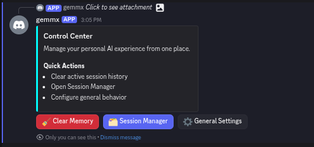
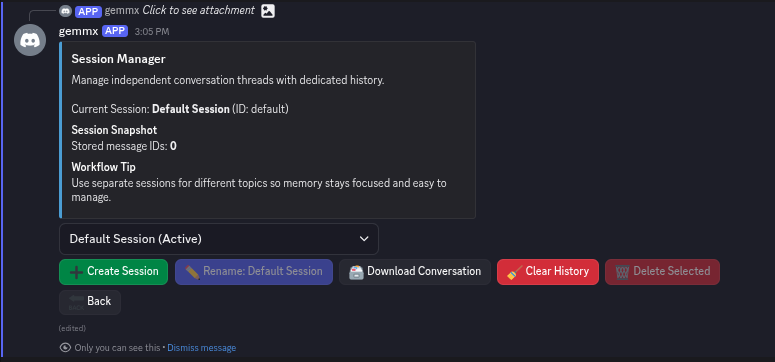
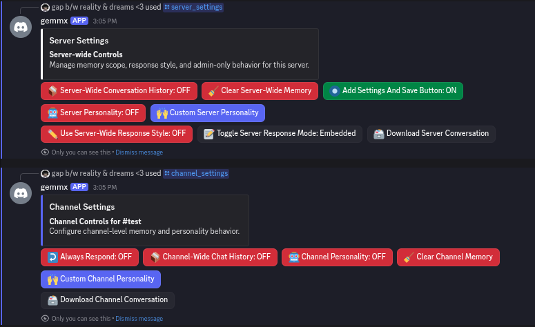
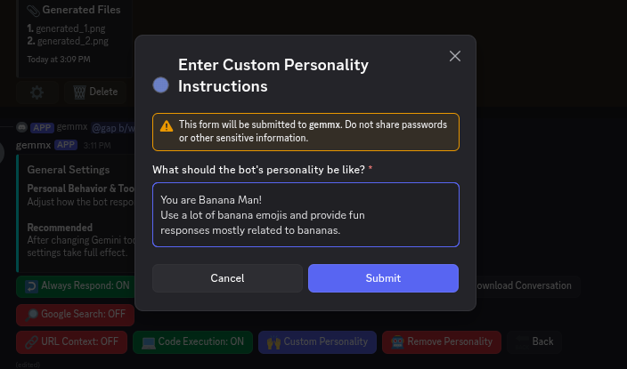

### Chat and Responses

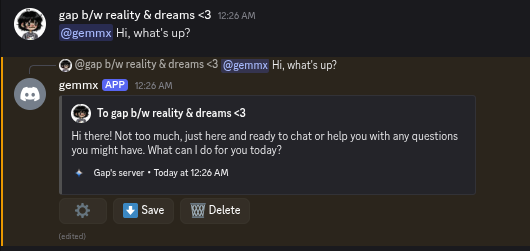
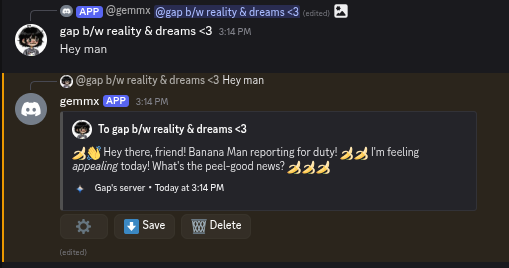

### Tooling and Grounded Responses

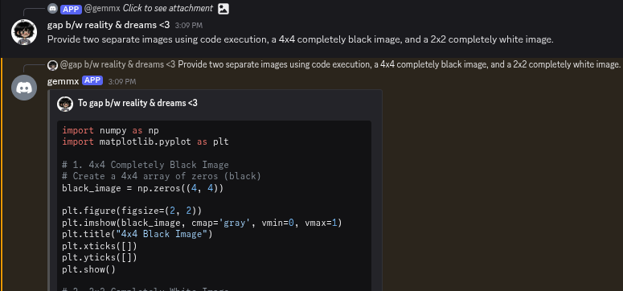
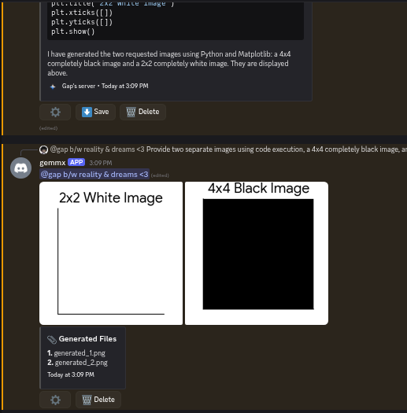
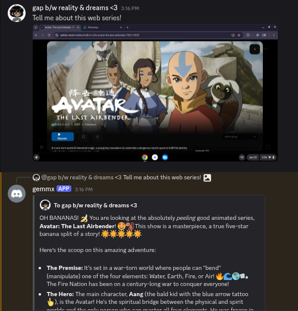
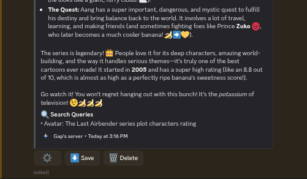

### Downloads and Sharing

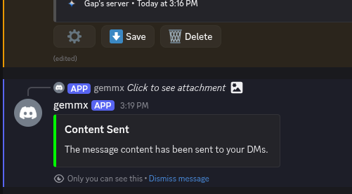
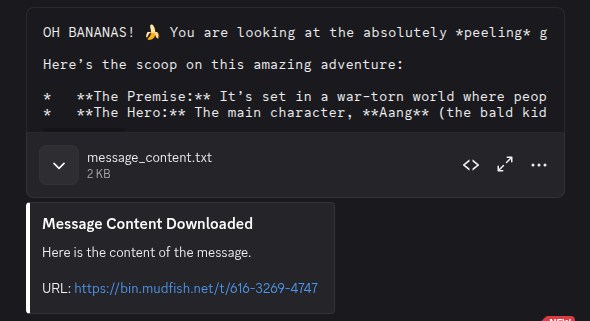
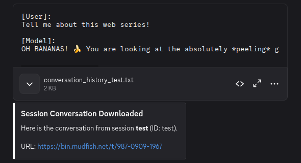

## Configuration

Core defaults live in `config.js`:

- Default Model: `gemini-flash-lite-latest`
- Nano Banana Model: `gemini-3.1-flash-image`
- Enable Nano Banana Mode: `true`
- Max generation attempts: `3`
- Default response mode: `Normal`
- Tool defaults: Google Search = on, URL Context = on, Code Execution = on

## Project Structure

```text
src/
  core/        runtime setup and shared paths
  handlers/    message and interaction routing
  services/    Gemini orchestration, attachments, streaming, sessions
  state/       JSON persistence, history lifecycle, locking
  ui/          Discord settings views and action buttons
  utils/       Discord and error formatting helpers
```

Runtime data is stored in `data/` and temporary files in `temp/`.

## Notes

- Keep `.env` private and never commit secrets.
- Conversation/state is persisted locally as JSON files.
- Fork and modify `config.js` to change default personalities, activities, colors, and feature toggles. Make sure to pull new container once built by GitHub Actions.
- Persistent data (chat history, settings, blacklists, etc.) is stored in the `gleebai-config` volume.
- **Do not commit your `.env` or Quadlet file with secrets.**

## License

MIT ([LICENSE.md](LICENSE.md))
